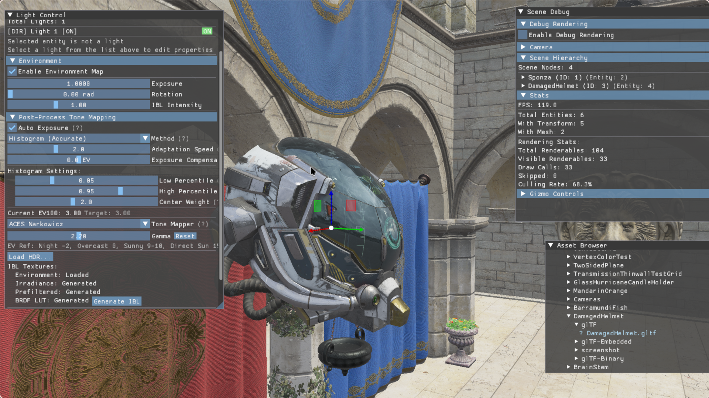

# Violet Engine



A modern Vulkan-based 3D graphics engine written in C++20, featuring physically-based rendering and a complete scene editor.

## Features

- **Rendering**: Vulkan PBR pipeline with IBL, auto-exposure, and tone mapping
- **Assets**: Full glTF 2.0 scene loading with async loading and hot-reload support
- **Architecture**: ECS system (EnTT), BVH spatial acceleration, Morton Code culling
- **Editor**: ImGui debug interface, scene hierarchy editor, 3D gizmo transform tools

## Quick Start

```bash
# Build
./build.sh

# Run
./build/bin/VioletEngine
```

**Controls**
- WASD / Space / Shift: Camera movement
- Right-click + Drag: Camera rotation
- T / R / E: Translate / Rotate / Scale mode

## Dependencies

Managed via vcpkg:
- **Core**: Vulkan, EASTL, EnTT, VulkanMemoryAllocator, GLFW, GLM
- **Assets**: tinygltf (glTF 2.0), KTX, STB
- **UI**: ImGui, ImGuizmo
- **Utils**: spdlog, fmt, Slang

## Architecture

```
src/
├── renderer/     # Vulkan renderer (ForwardRenderer, RenderGraph, post-processing)
├── resource/     # Resource management (ShaderLibrary, MaterialManager, async loading)
├── ecs/          # ECS system (World, Components)
├── scene/        # Scene graph and glTF loading
├── ui/           # ImGui editor interface
└── acceleration/ # BVH spatial acceleration
```

**Rendering Pipeline**
- Bindless material system (1024 texture array)
- Multi-pass architecture: Main Pass (HDR) → Auto-Exposure → Post-Process → Present
- Physical light units: Directional (lux), Point (lumens)


## License

MIT License - Copyright (c) 2024 Violet Engine
