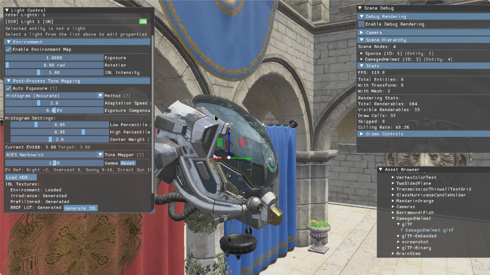

# Violet Engine



A modern Vulkan-based 3D graphics engine written in C++20, featuring declarative RenderGraph architecture, bindless rendering, and Slang shader reflection.

## Key Features

- **RenderGraph System**: Declarative multi-pass rendering with automatic barrier generation and transient resource management
- **Bindless Rendering**: Texture arrays with UPDATE_AFTER_BIND, eliminating per-draw descriptor updates
- **Slang Reflection**: Runtime shader reflection for automatic descriptor layout and resource management
- **PBR Pipeline**: Physically-based rendering with IBL, cascaded shadow maps, and physical light units (lux/lumens)
- **Post-Processing**: Histogram-based auto-exposure and ACES Filmic tone mapping
- **glTF 2.0**: Full scene loading with async resource streaming via ThreadPool
- **ECS Architecture**: EnTT-based entity system with BVH spatial acceleration

## Quick Start

```bash
# Build
./build.sh

# Run
./build/bin/VioletEngine

# Enable validation layers
export VIOLET_DEBUG=1
./build/bin/VioletEngine
```

**Controls**
- WASD / Space / Shift: Camera movement
- Right-click + Drag: Camera rotation
- T / R / E: Translate / Rotate / Scale mode

## Architecture Highlights

### RenderGraph System
Declarative per-frame rebuild pattern with automatic synchronization:
```cpp
renderGraph->clear();
renderGraph->importImage("swapchain", ...);
renderGraph->createImage("hdr", ...);  // Transient resource

renderGraph->addPass("Main", [](builder, pass) {
    builder.write("hdr", ResourceUsage::ColorAttachment);
    builder.execute([](cmd, frame) { /* render */ });
});

renderGraph->addPass("Tonemap", [](builder, pass) {
    builder.read("hdr", ResourceUsage::ShaderRead);
    builder.write("swapchain", ResourceUsage::Present);
});

renderGraph->build();
renderGraph->compile();
renderGraph->execute(cmd, frameIndex);
```

### Bindless Rendering
- **Set 0**: Per-frame resources (Camera, Lights, Shadows) - Dynamic offsets for triple buffering
- **Set 1**: Bindless texture arrays (1024 textures, 64 cubemaps) - UPDATE_AFTER_BIND
- **Set 2**: Materials SSBO - All material data in single buffer
- **Push Constants**: Model matrix + materialID

Shader access:
```slang
uint texIdx = materials[push.materialID].baseColorTexIndex;
float4 color = textures[NonUniformResourceIndex(texIdx)].Sample(sampler, uv);
```

### Slang Shader Reflection
Automatic resource management via runtime reflection:
```cpp
// C++ side - type-safe reflection API
auto lightProxy = (*globalResources)["lights"][i];
lightProxy["positionAndType"] = cpuLightData[i].positionAndType;
lightProxy["colorAndRadius"] = cpuLightData[i].colorAndRadius;

// Slang shader defines structure
struct LightData {
    float4 positionAndType;
    float4 colorAndRadius;
    int shadowIndex;
};
[[vk::binding(1, 0)]]
StructuredBuffer<LightData> lights;
```

Benefits: Single source of truth, no manual buffer management, type-safe field access.

## Technology Stack

**Core:** Vulkan, EASTL, EnTT, VulkanMemoryAllocator, GLFW, GLM
**Shaders:** Slang (100% of shaders, runtime compilation)
**Assets:** tinygltf (glTF 2.0), KTX, STB
**UI:** ImGui, ImGuizmo
**Build:** CMake + vcpkg

## Project Structure

```
src/
├── renderer/       # Vulkan renderer, RenderGraph, post-processing effects
│   ├── graph/      # RenderGraph DAG and barrier generation
│   ├── vulkan/     # Core Vulkan wrappers (pipelines, descriptors, shaders)
│   └── effect/     # Auto-exposure, tone mapping, IBL
├── resource/       # ShaderLibrary, MaterialManager, async loading
├── ecs/            # EnTT-based entity component system
├── scene/          # Scene graph and glTF loading
├── ui/             # ImGui editor interface
└── acceleration/   # BVH spatial acceleration (Morton codes)

shaders/slang/      # All shaders (graphics, compute, modules)
```

## Rendering Pipeline

1. **Shadow Pass**: Cascaded shadow maps (4 cascades, 8192x8192 atlas)
2. **Main Pass**: PBR rendering to HDR buffer (rgba16f)
3. **Auto-Exposure**: Histogram-based luminance analysis
4. **Tone Mapping**: ACES Filmic with adaptive exposure
5. **Present**: Final output to swapchain

## License

MIT License - Copyright (c) 2024 Violet Engine